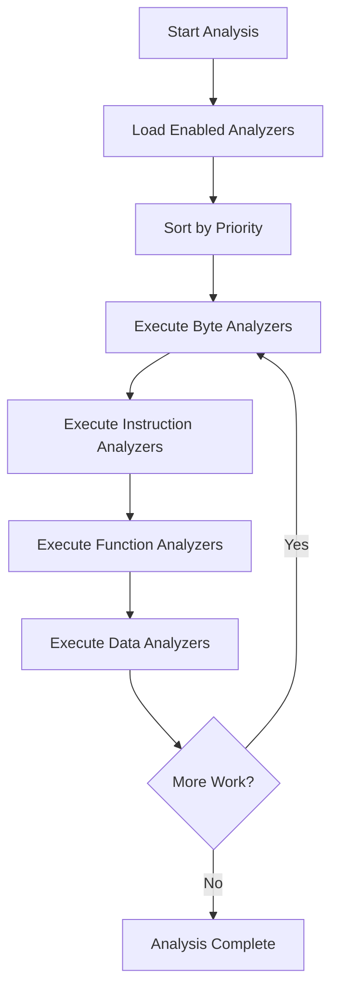

## Analysis Overview

Ghidra's analysis system is a sophisticated pipeline that automatically processes programs to identify functions, data structures, references, and other program semantics. The system is designed to be extensible, prioritized, and incremental.

## Auto-Analysis Manager

The `AutoAnalysisManager` coordinates all analysis activities for a program:

```java
// From ghidra/app/plugin/core/analysis/AutoAnalysisManager.java:57-63
public class AutoAnalysisManager {
    // Manages analysis task scheduling
    private AnalysisTaskList byteTasks;
    private AnalysisTaskList functionTasks;
    private AnalysisTaskList instructionTasks;
    private AnalysisTaskList dataTasks;
    
    public static AutoAnalysisManager getAnalysisManager(Program program);
    public void startAnalysis(TaskMonitor monitor);
    public void reAnalyzeAll(AddressSetView addresses);
}
```

**Key Responsibilities:**

- Schedule analyzers by priority
- Manage address sets for incremental analysis
- Coordinate parallel analysis tasks
- Track analysis state and progress
- Handle analysis events and dependencies

From `ghidra/app/plugin/core/analysis/AutoAnalysisManager.java:63-150`

## Analyzer Interface

All analyzers implement the `Analyzer` interface:

```java
// From ghidra/app/services/Analyzer.java:27-44
public interface Analyzer extends ExtensionPoint {
    // Analyzer identification
    String getName();
    String getDescription();
    AnalyzerType getAnalysisType();
    
    // Configuration
    AnalysisPriority getPriority();
    boolean getDefaultEnablement(Program program);
    boolean canAnalyze(Program program);
    
    // Analysis callbacks
    boolean added(Program program, AddressSetView set, 
                  TaskMonitor monitor, MessageLog log);
    boolean removed(Program program, AddressSetView set,
                   TaskMonitor monitor, MessageLog log);
    
    // Options management
    void registerOptions(Options options, Program program);
    void optionsChanged(Options options, Program program);
    void analysisEnded(Program program);
}
```

### Analyzer Properties

<CardGroup cols={2}>
  <Card title="Name" icon="tag">
    Unique identifier for the analyzer
  </Card>
  <Card title="Type" icon="list">
    Classification (bytes, instructions, functions, data)
  </Card>
  <Card title="Priority" icon="arrow-up-1-9">
    Execution order relative to other analyzers
  </Card>
  <Card title="Enablement" icon="toggle-on">
    Default enabled/disabled state
  </Card>
</CardGroup>

## Analysis Types

Analyzers are categorized by what they analyze:

```java
public enum AnalyzerType {
    BYTE_ANALYZER,        // Process raw bytes
    INSTRUCTION_ANALYZER, // Analyze instructions
    FUNCTION_ANALYZER,    // Analyze functions
    FUNCTION_MODIFIERS_ANALYZER,    // Function properties
    FUNCTION_SIGNATURES_ANALYZER,   // Function signatures
    DATA_ANALYZER         // Analyze data
}
```

**Analysis Order:**

<Steps>
  <Step title="Byte Analysis">
    Process raw bytes to identify patterns and structures
  </Step>
  
  <Step title="Instruction Analysis">
    Analyze disassembled instructions and code flow
  </Step>
  
  <Step title="Function Analysis">
    Identify and analyze function boundaries and properties
  </Step>
  
  <Step title="Data Analysis">
    Identify and type data structures
  </Step>
</Steps>

## Analyzer Priorities

Priority determines execution order within each analysis type:

```java
public class AnalysisPriority {
    public static final AnalysisPriority BLOCK_ANALYSIS;
    public static final AnalysisPriority DISASSEMBLY;
    public static final AnalysisPriority CODE_ANALYSIS;
    public static final AnalysisPriority FUNCTION_ID_ANALYSIS;
    public static final AnalysisPriority FUNCTION_ANALYSIS;
    public static final AnalysisPriority DATA_TYPE_PROPOGATION;
    public static final AnalysisPriority DATA_ANALYSIS;
    public static final AnalysisPriority REFERENCE_ANALYSIS;
}
```

**Priority Guidelines:**

- Lower numbers run first
- Disassembly before function analysis
- Function analysis before data propagation
- Reference analysis runs late

## Built-in Analyzers

Ghidra includes many standard analyzers:

### Core Analyzers

<AccordionGroup>
  <Accordion title="Disassembler">
    Converts bytes to instructions at entry points and code references.
    
    **Priority:** Very High  
    **Type:** Instruction Analyzer
    
    ```java
    DisassembleCommand cmd = new DisassembleCommand(addr, null, true);
    cmd.applyTo(program, monitor);
    ```
  </Accordion>
  
  <Accordion title="Function Start Search">
    Identifies function entry points using various heuristics:
    - Call targets
    - Code patterns
    - External references
    - Entry points
    
    **Priority:** High  
    **Type:** Function Analyzer
  </Accordion>
  
  <Accordion title="Decompiler Parameter ID">
    Uses decompiler to identify function parameters and return values.
    
    **Priority:** Medium  
    **Type:** Function Signatures Analyzer
    
    Requires the decompiler to be available.
  </Accordion>
  
  <Accordion title="Stack Analysis">
    Analyzes stack frame usage to identify local variables and parameters.
    
    **Priority:** Medium  
    **Type:** Function Analyzer
  </Accordion>
  
  <Accordion title="Data Reference">
    Identifies data references from code:
    - Immediate operands
    - Memory references  
    - String references
    
    **Priority:** Low  
    **Type:** Instruction Analyzer
  </Accordion>
  
  <Accordion title="Demangler">
    Demangles C++ and other mangled symbol names.
    
    **Priority:** Low  
    **Type:** Function Analyzer
    
    Supports multiple demangling schemes (GNU, Microsoft, etc.)
  </Accordion>
</AccordionGroup>

## Writing Custom Analyzers

### Basic Analyzer Template

```java
import ghidra.app.services.*;
import ghidra.app.util.importer.MessageLog;
import ghidra.framework.options.Options;
import ghidra.program.model.address.AddressSetView;
import ghidra.program.model.listing.Program;
import ghidra.util.exception.CancelledException;
import ghidra.util.task.TaskMonitor;

public class MyAnalyzer extends AbstractAnalyzer {
    
    public MyAnalyzer() {
        super("My Analyzer", "Description of what it does", 
              AnalyzerType.INSTRUCTION_ANALYZER);
        // Set priority
        setPriority(AnalysisPriority.CODE_ANALYSIS);
        // Default to enabled
        setDefaultEnablement(true);
        // Supports one-time analysis
        setSupportsOneTimeAnalysis(true);
    }
    
    @Override
    public boolean canAnalyze(Program program) {
        // Check if this analyzer applies to this program
        return true;
    }
    
    @Override
    public boolean added(Program program, AddressSetView set, 
                        TaskMonitor monitor, MessageLog log)
            throws CancelledException {
        
        // Perform analysis
        monitor.setMessage("Running My Analyzer...");
        monitor.initialize(set.getNumAddresses());
        
        AddressIterator iter = set.getAddresses(true);
        while (iter.hasNext()) {
            monitor.checkCancelled();
            Address addr = iter.next();
            
            // Analyze this address
            analyzeAddress(program, addr, monitor, log);
            
            monitor.incrementProgress(1);
        }
        
        return true;
    }
    
    private void analyzeAddress(Program program, Address addr,
                               TaskMonitor monitor, MessageLog log) {
        // Your analysis logic here
        Instruction inst = program.getListing().getInstructionAt(addr);
        if (inst != null) {
            // Process instruction
        }
    }
    
    @Override
    public void registerOptions(Options options, Program program) {
        // Register analyzer options
        options.registerOption("My Option", true, null,
            "Description of this option");
    }
    
    @Override
    public void optionsChanged(Options options, Program program) {
        // Read option values
        boolean myOption = options.getBoolean("My Option", true);
    }
}
```

<Note>
  Analyzer class names must end with "Analyzer" to be discovered by the
  ClassSearcher system.
</Note>

### Analyzer Best Practices

<AccordionGroup>
  <Accordion title="Check Cancellation">
    Always check for cancellation in loops:
    
    ```java
    monitor.checkCancelled();
    ```
  </Accordion>
  
  <Accordion title="Update Progress">
    Keep the user informed:
    
    ```java
    monitor.setMessage("Analyzing functions...");
    monitor.initialize(total);
    monitor.incrementProgress(1);
    ```
  </Accordion>
  
  <Accordion title="Log Important Info">
    Use the MessageLog:
    
    ```java
    log.appendMsg("Found " + count + " patterns");
    log.appendException(e);
    ```
  </Accordion>
  
  <Accordion title="Use Transactions">
    Wrap modifications in transactions:
    
    ```java
    int txId = program.startTransaction("My Analysis");
    try {
        // Make changes
        program.endTransaction(txId, true);
    } catch (Exception e) {
        program.endTransaction(txId, false);
    }
    ```
  </Accordion>
  
  <Accordion title="Manage Dependencies">
    Document analyzer dependencies and set appropriate priorities.
  </Accordion>
</AccordionGroup>

## Analysis Lifecycle

### Starting Analysis

Analysis can be triggered multiple ways:

```java
// Automatic on import
AutoAnalysisManager.getAnalysisManager(program)
    .scheduleWorker(new AutoAnalysisWorker(monitor));

// Manual via API
AutoAnalysisManager mgr = AutoAnalysisManager.getAnalysisManager(program);
mgr.startAnalysis(monitor);

// Incremental analysis on specific addresses
AddressSet set = new AddressSet(addr1, addr2);
mgr.reAnalyzeAll(set);
```

### Analysis Flow



### Analysis Tasks

Tasks are queued for each analyzer and address range:

```java
private class AnalysisTaskList {
    void addTask(AnalyzerAdapter analyzer, AddressSetView set);
    AnalysisTask getNextTask();
    boolean hasMoreTasks();
}
```

From `ghidra/app/plugin/core/analysis/AutoAnalysisManager.java:96-103`

## Parallel Analysis

Some analyzers support parallel execution:

```java
// Get shared thread pool
GThreadPool pool = GThreadPool.getSharedThreadPool(
    AutoAnalysisManager.SHARED_THREAD_POOL_NAME
);

// Submit parallel tasks
pool.submit(() -> {
    analyzeRange(range1);
});
pool.submit(() -> {
    analyzeRange(range2);
});

// Wait for completion
pool.waitForAll();
```

<Warning>
  When using parallel analysis, ensure proper synchronization when accessing
  shared program resources.
</Warning>

## Analysis Options

Analyzers can be configured via the analysis options:

```java
Options options = program.getOptions(Program.ANALYSIS_PROPERTIES);

// Get analyzer-specific options
Options analyzerOptions = options.getOptions("My Analyzer");
boolean enabled = analyzerOptions.getBoolean("My Option", true);

// Set options
analyzerOptions.setBoolean("My Option", false);
```

### Common Options

- Enable/disable specific analyzers
- Configure analyzer-specific behavior
- Set analysis boundaries
- Control aggressiveness

## Analysis State

Programs track whether they've been analyzed:

```java
Options info = program.getOptions(Program.PROGRAM_INFO);

// Check if analyzed
boolean analyzed = info.getBoolean(Program.ANALYZED_OPTION_NAME, false);

// Mark as analyzed
info.setBoolean(Program.ANALYZED_OPTION_NAME, true);

// Control analysis prompt
info.setBoolean(Program.ASK_TO_ANALYZE_OPTION_NAME, true);
```

From `ghidra/program/model/listing/Program.java:61-64`

## Incremental Analysis

Ghidra supports incremental re-analysis:

```java
// Re-analyze specific addresses
AddressSet changedAddrs = new AddressSet();
changedAddrs.add(addr1, addr2);

AutoAnalysisManager mgr = AutoAnalysisManager.getAnalysisManager(program);
mgr.reAnalyzeAll(changedAddrs);
```

**Triggers for Incremental Analysis:**

- User clears code/data
- Function boundaries change
- New memory blocks added
- Data types modified

## Analysis Performance

### Optimization Tips

<AccordionGroup>
  <Accordion title="Minimize Address Set Iteration">
    Process addresses in batches:
    
    ```java
    AddressRangeIterator ranges = set.getAddressRanges();
    while (ranges.hasNext()) {
        AddressRange range = ranges.next();
        processRange(range);
    }
    ```
  </Accordion>
  
  <Accordion title="Cache Frequently Used Data">
    Avoid repeated lookups:
    
    ```java
    Memory memory = program.getMemory();
    SymbolTable symbolTable = program.getSymbolTable();
    // Use cached references
    ```
  </Accordion>
  
  <Accordion title="Use Efficient Data Structures">
    AddressSet is optimized for range operations:
    
    ```java
    AddressSet set = new AddressSet();
    set.add(new AddressRangeImpl(start, end));
    ```
  </Accordion>
  
  <Accordion title="Avoid Excessive Transactions">
    Batch related changes:
    
    ```java
    int txId = program.startTransaction("Batch update");
    try {
        // Multiple changes
        program.endTransaction(txId, true);
    }
    ```
  </Accordion>
</AccordionGroup>

## Debugging Analyzers

### Logging

```java
import ghidra.util.Msg;

public class MyAnalyzer extends AbstractAnalyzer {
    @Override
    public boolean added(Program program, AddressSetView set,
                        TaskMonitor monitor, MessageLog log) {
        
        Msg.debug(this, "Starting analysis at " + set.getMinAddress());
        Msg.info(this, "Found " + count + " items");
        Msg.warn(this, "Potential issue detected");
        Msg.error(this, "Analysis failed", exception);
        
        return true;
    }
}
```

### Testing

```java
@Test
public void testMyAnalyzer() throws Exception {
    Program program = createTestProgram();
    
    MyAnalyzer analyzer = new MyAnalyzer();
    AddressSet set = new AddressSet(addr(0x1000), addr(0x2000));
    MessageLog log = new MessageLog();
    
    boolean success = analyzer.added(program, set, 
                                     TaskMonitor.DUMMY, log);
    
    assertTrue(success);
    // Verify analysis results
}
```

## Analysis Events

Monitor analysis progress:

```java
public interface AutoAnalysisManagerListener {
    void analysisStarted(Program program);
    void analysisEnded(Program program);
    void analyzerStatusChanged(String analyzerName, boolean enabled);
}

AutoAnalysisManager mgr = AutoAnalysisManager.getAnalysisManager(program);
mgr.addListener(new AutoAnalysisManagerListener() {
    @Override
    public void analysisEnded(Program program) {
        Msg.info(this, "Analysis complete");
    }
});
```

## Best Practices

<AccordionGroup>
  <Accordion title="Analyzer Design">
    - Keep analyzers focused on one task
    - Document dependencies and requirements
    - Provide meaningful options
    - Handle edge cases gracefully
  </Accordion>
  
  <Accordion title="Performance">
    - Minimize database access
    - Use efficient data structures
    - Consider parallel execution
    - Profile and optimize hot paths
  </Accordion>
  
  <Accordion title="User Experience">
    - Provide clear progress feedback
    - Allow cancellation
    - Log important findings
    - Document what the analyzer does
  </Accordion>
  
  <Accordion title="Testing">
    - Test on diverse programs
    - Verify correctness
    - Check performance
    - Test cancellation behavior
  </Accordion>
</AccordionGroup>

## Next Steps

<CardGroup cols={2}>
  <Card title="Programs" icon="microchip" href="/concepts/programs">
    Learn about the program model
  </Card>
  <Card title="Projects" icon="folder-tree" href="/concepts/projects">
    Understand project organization
  </Card>
  <Card title="Architecture" icon="diagram-project" href="/concepts/architecture">
    Explore framework architecture
  </Card>
  <Card title="Overview" icon="book" href="/concepts/overview">
    Return to framework overview
  </Card>
</CardGroup>