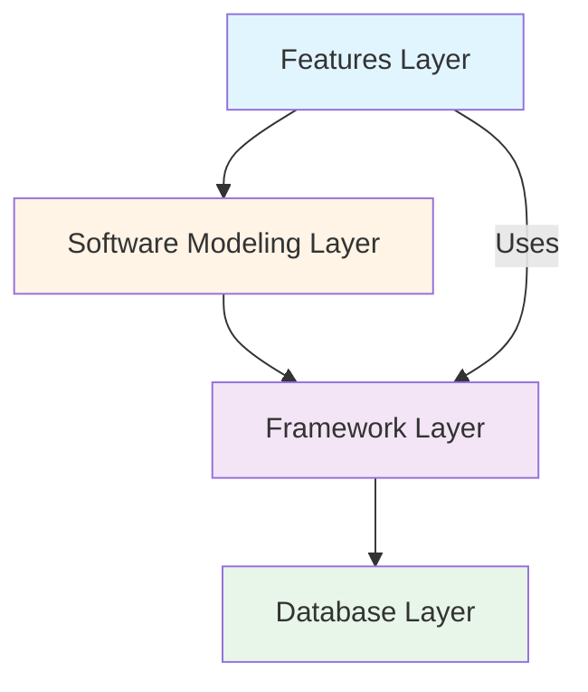

## Architectural Overview

Ghidra is built as a layered framework with clear separation of concerns. Each layer builds upon the services provided by lower layers, creating a modular and extensible architecture.



## Framework Layer

The framework layer provides core infrastructure services that all higher layers depend on.

### Project Management Module

Location: `Ghidra/Framework/Project/`

The Project module manages the lifecycle of projects, tools, and domain files:

```java
// From ghidra/framework/model/Project.java:26-33
public interface Project extends AutoCloseable, Iterable<DomainFile> {
    String getName();
    ProjectLocator getProjectLocator();
    ProjectManager getProjectManager();
    ToolManager getToolManager();
    ToolServices getToolServices();
    ProjectData getProjectData();
}
```

**Key Components:**

- **DefaultProject** - Main project implementation
- **ProjectData** - File system abstraction for domain files
- **ToolManager** - Manages tool instances and configurations
- **DomainObjectAdapter** - Base implementation for persistent objects

### Database Module

Location: `Ghidra/Framework/DB/`

Provides a custom file-based database optimized for Ghidra's needs:

```java
// Database handle for domain objects
public class DBHandle {
    public Table getTable(String name);
    public Table createTable(String name, Schema schema);
    public void startTransaction();
    public long endTransaction(long transactionID, boolean commit);
    // ... buffer management and versioning
}
```

**Features:**

- **Buffer Management** - Efficient paging of database content
- **Versioning** - Built-in version control with undo/redo
- **Transactions** - ACID transaction support
- **Indexing** - B-tree indexes for fast lookups
- **Schema Evolution** - Handles database schema changes

From `ghidra/framework/model/DomainObject.java:472-484`

### Docking Module

Location: `Ghidra/Framework/Docking/`

Provides the windowing system for Ghidra's user interface:

- **ComponentProvider** - Base class for dockable windows
- **DockingWindowManager** - Manages window layout and persistence
- **ActionContext** - Context for executing user actions
- **DockingAction** - Represents menu items and toolbar buttons

### Generic Module

Location: `Ghidra/Framework/Generic/`

Common utilities and infrastructure:

- **Application** - Application lifecycle management
- **TaskMonitor** - Progress monitoring and cancellation
- **ClassSearcher** - Dynamic class discovery via ExtensionPoint
- **Options** - Configuration and preferences system

## Software Modeling Layer

The software modeling layer provides the program model and analysis infrastructure.

Location: `Ghidra/Framework/SoftwareModeling/`

### Program Model

The central abstraction for representing executable programs:

```java
// From ghidra/program/model/listing/Program.java:40-53
public interface Program extends DataTypeManagerDomainObject, ProgramArchitecture {
    Listing getListing();
    Memory getMemory();
    SymbolTable getSymbolTable();
    FunctionManager getFunctionManager();
    ReferenceManager getReferenceManager();
    BookmarkManager getBookmarkManager();
    EquateTable getEquateTable();
    ExternalManager getExternalManager();
    // ... data type and language services
}
```

**Managers and Services:**

<AccordionGroup>
  <Accordion title="Memory Manager">
    Manages memory blocks, address spaces, and byte access
    
    ```java
    public interface Memory extends AddressSetView {
        MemoryBlock createInitializedBlock(String name, Address start, 
                                           long size, byte initialValue);
        AddressSetView getLoadedAndInitializedAddressSet();
        byte getByte(Address addr);
        void setByte(Address addr, byte value);
    }
    ```
    
    From `ghidra/program/model/mem/Memory.java:30-79`
  </Accordion>
  
  <Accordion title="Symbol Table">
    Manages symbols, namespaces, and labels
    
    - Labels and function names
    - Namespace hierarchy
    - Symbol references and scope
    - External symbols
  </Accordion>
  
  <Accordion title="Function Manager">
    Tracks functions and their properties
    
    - Function boundaries
    - Parameters and return values
    - Local variables
    - Call relationships
  </Accordion>
  
  <Accordion title="Reference Manager">
    Tracks memory references and cross-references
    
    - Code and data references
    - Stack references
    - External references
    - Reference types and offsets
  </Accordion>
</AccordionGroup>

### Address Model

Addresses in Ghidra are multi-dimensional:

```java
// From ghidra/program/model/address/Address.java:23-30
public interface Address extends Comparable<Address> {
    AddressSpace getAddressSpace();
    long getOffset();
    Address add(long displacement);
    Address subtract(long displacement);
    long subtract(Address addr);
    // ... address arithmetic
}
```

**Address Spaces:**

From `ghidra/program/model/address/AddressSpace.java:28-46`

```java
public interface AddressSpace extends Comparable<AddressSpace> {
    public static final int TYPE_RAM = 1;
    public static final int TYPE_REGISTER = 4;
    public static final int TYPE_STACK = 5;
    public static final int TYPE_OTHER = 7;
    public static final int TYPE_EXTERNAL = 10;
    
    String getName();
    int getSpaceID();
    int getSize();
    int getAddressableUnitSize();
}
```

<Note>
  Address spaces allow Ghidra to represent different contexts within a program:
  - **RAM** - Physical memory
  - **REGISTER** - Processor registers  
  - **STACK** - Stack-relative addressing
  - **OTHER** - Non-loaded data (headers, debug info)
  - **EXTERNAL** - External library references
</Note>

From `ghidra/program/model/address/AddressSpace.java:68-89`

### Language System

Processor specifications define instruction semantics:

- **SLEIGH** - Domain-specific language for instruction encoding
- **Processor Definitions** - Located in `Ghidra/Processors/`
- **P-code** - Intermediate representation for analysis
- **Compiler Specifications** - Calling conventions and ABI details

## Features Layer

The features layer provides user-facing functionality built on the framework.

### Base Module

Location: `Ghidra/Features/Base/`

Core analysis features and the CodeBrowser tool:

**Analysis Services:**

```java
// From ghidra/app/services/Analyzer.java:27-33
public interface Analyzer extends ExtensionPoint {
    String getName();
    AnalyzerType getAnalysisType();
    boolean getDefaultEnablement(Program program);
    String getDescription();
    AnalysisPriority getPriority();
    boolean canAnalyze(Program program);
    boolean added(Program program, AddressSetView set, 
                  TaskMonitor monitor, MessageLog log);
}
```

**Built-in Analyzers:**

- Disassembly and instruction analysis
- Function discovery and boundaries
- Stack analysis and parameter detection
- Reference discovery
- Data type propagation
- Symbol demangling

From `ghidra/app/services/Analyzer.java:28-44`

### Decompiler Module

Location: `Ghidra/Features/Decompiler/`

- **C++ Native Engine** - High-performance decompilation
- **Java Integration** - Bridge between native and Java layers
- **High P-code** - Simplified intermediate representation
- **Type Recovery** - Infer data types from usage

### File Formats Module

Location: `Ghidra/Features/FileFormats/`

Binary format parsers and loaders:

- PE (Windows executables)
- ELF (Linux/Unix executables)
- Mach-O (macOS executables)
- COFF archives
- Android formats (DEX, VDEX, ART)

## Component Interactions

Here's how components work together during typical operations:

### Opening a Program

<Steps>
  <Step title="Load Domain File">
    ProjectData retrieves the DomainFile from the file system
  </Step>
  
  <Step title="Open Database">
    DBHandle opens the underlying database file
  </Step>
  
  <Step title="Initialize Program">
    ProgramDB instantiates managers (Memory, Symbol, Function, etc.)
  </Step>
  
  <Step title="Register Listeners">
    Tools register for domain object events
  </Step>
</Steps>

### Performing Analysis

<Steps>
  <Step title="Start Transaction">
    AutoAnalysisManager begins a transaction
  </Step>
  
  <Step title="Queue Analyzers">
    Analyzers are queued by priority
  </Step>
  
  <Step title="Execute Analysis">
    Each analyzer processes address ranges
  </Step>
  
  <Step title="Propagate Events">
    Changes trigger events to update UI
  </Step>
  
  <Step title="Commit Transaction">
    Transaction completes, changes are saved
  </Step>
</Steps>

From `ghidra/app/plugin/core/analysis/AutoAnalysisManager.java:57-63`

## Extension Points

Ghidra provides multiple extension mechanisms:

### Plugin Extension

```java
@PluginInfo(
    status = PluginStatus.RELEASED,
    packageName = CorePluginPackage.NAME,
    category = PluginCategoryNames.ANALYSIS
)
public class MyPlugin extends Plugin {
    // Extend functionality
}
```

### Analyzer Extension

```java
public class MyAnalyzer extends AbstractAnalyzer {
    @Override
    public boolean added(Program program, AddressSetView set, 
                        TaskMonitor monitor, MessageLog log) {
        // Custom analysis logic
        return true;
    }
}
```

### Loader Extension

Custom file format loaders implement the Loader interface.

### Language Extension

New processor support via SLEIGH specifications.

## Performance Considerations

<Warning>
  Key performance characteristics to understand:
  
  - Database operations are cached but can still be slow for large programs
  - Address sets use efficient range representations
  - Event notification is buffered to reduce overhead
  - Analyzer priorities determine execution order for optimal performance
</Warning>

## Module Dependencies

The dependency hierarchy ensures clean layering:

```
Features (Base, Decompiler, etc.)
    ↓
Framework/SoftwareModeling
    ↓
Framework/Project
    ↓  
Framework/DB, Docking, Generic
    ↓
Framework/Utility
```

## Next Steps

<CardGroup cols={2}>
  <Card title="Projects" icon="folder-tree" href="/concepts/projects">
    Learn about project organization and version control
  </Card>
  <Card title="Programs" icon="microchip" href="/concepts/programs">
    Deep dive into the program model
  </Card>
  <Card title="Analysis" icon="microscope" href="/concepts/analysis">
    Understand the analysis pipeline
  </Card>
  <Card title="Overview" icon="book" href="/concepts/overview">
    Return to framework overview
  </Card>
</CardGroup>